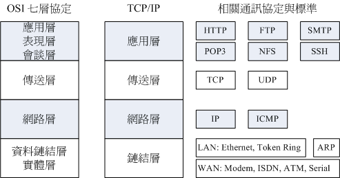

#
```
機密性(Confidentiality)
資訊不得被未經授權之個人、實體或程序所取得或揭露的性質
```
```
完整性(Integrity)
對資訊之精確與完整安全保證的性質
```
```
可用性(Availability )
已授權實體在需要時可存取與使用資訊之性質
```
```
鑑別度(Authenticity)
可證明一主體或資源之識別就是其所聲明者的特性。鑑別性適用於如使用者、程序、系統與資訊等實體
```
```
不可否認性(Non-repudiation)
對一已發生之行動或事件的證明，使該行動或事件往後不能被否認的能力
```
```
可靠度(Reliability)
始終如一預期之行為與結果的性質
```
```
可歸責性(Accountability)
確保實體之行為可唯一追溯到該實體的性質
```



```
應用層（Application Layer）提供為應用軟體而設的介面，以設定與另一應用軟體之間的通訊。
例如: HTTP，HTTPS，FTP，TELNET，SSH，SMTP，POP3.HTML.等。
```
```
表達層（Presentation Layer）把資料轉換為能與接收者的系統格式相容並適合傳輸的格式。
```
```
會議層（Session Layer）負責在資料傳輸中設定和維護電腦網路中兩台電腦之間的通訊連接。
```
```
傳輸層（Transport Layer）把傳輸表頭（TH）加至資料以形成資料包。
傳輸表頭包含了所使用的協定等傳送資訊。例如:傳輸控制協定（TCP）等。
```
```
網路層（Network Layer）決定資料的路徑選擇和轉寄，將網路表頭（NH）加至資料包，
以形成封包。網路表頭包含了網路資料。例如:網際網路協定（IP）等。
```
```
資料連結層（Data Link Layer）負責網路尋址、錯誤偵測和改錯。當表頭和表尾被加至資料包時，會形成影格。
資料連結串列頭（DLH）是包含了實體位址和錯誤偵測
及改錯的方法。資料連結串列尾（DLT）是一串指示資料包末端的字串。
例如乙太網、無線區域網路（Wi-Fi）和通用分組無線服務（GPRS）等。
分為兩個子層：邏輯鏈路控制（logical link control，LLC）子層和媒介存取控制（Media access control，MAC）子層。
```
```
第1層 實體層
實體層（Physical Layer）在局部區域網路上傳送資料框（data frame）
它負責管理電腦通訊裝置和網路媒體之間的互通。
包括了針腳、電壓、線纜規範、集線器、中繼器、網卡、主機介面卡等。
```
```
[*]HTTP狀態碼
  ─ 1xx訊息——請求已被伺服器接收，繼續處理
  ─ 2xx成功——請求已成功被伺服器接收、理解、並接受
  ─ 3xx重新導向——需要後續操作才能完成這一請求
  ─ 4xx請求錯誤——請求含有詞法錯誤或者無法被執行
  ─ 5xx伺服器錯誤——伺服器在處理某個正確請求時發生錯誤
```
````
安全外殼協定(SSH)
是一種加密的網路傳輸協定，可在不安全的網路中為網路服務提供安全的傳輸環境。
雖然任何網路服務都可以通過SSH實現安全傳輸，SSH最常見的用途是遠端登入系統

[*]傳輸層安全性協定(TLS) Transport Layer Security及其前身安全通訊協定(SSL) Secure Sockets Layer 
  是一種安全協定，目的是為網際網路通訊提供安全及資料完整性保障。推出HTTPS協定，以SSL進行加密，這是SSL的起源。
  
[*]SSL包含記錄層（Record Layer）和傳輸層，記錄層協定確定傳輸層資料的封裝格式。
  傳輸層安全協定使用X.509認證，之後利用非對稱加密演算來對通訊方做身分認證，之後交換對稱金鑰作為會談金鑰（Session key）。
  這個會談金鑰是用來將通訊兩方交換的資料做加密，保證兩個應用間通訊的保密性和可靠性，使客戶與伺服器應用之間的通訊不被攻擊者竊聽。
  
  [*]TLS協定採用主從式架構模型，用於在兩個應用程式間透過網路建立起安全的連線，防止在交換資料時受到竊聽及篡改。
  [*]TLS協定的優勢是與高層的應用層協定（如HTTP、FTP、Telnet等）無耦合。
  [*]應用層協定能透明地執行在TLS協定之上，由TLS協定進行建立加密通道需要的協商和認證。
  [*]應用層協定傳送的資料在通過TLS協定時都會被加密，從而保證通訊的私密性。

● 網際網路安全協定(IPsec) Internet Protocol Security：
  是一個協定套件，透過對IP協定的封包進行加密和認證來保護IP協定的網路傳輸協定族（一些相互關聯的協定的集合）。
 
  IPsec主要由以下協定組成：一、認證頭（AH），為IP資料報提供無連接資料完整性、訊息認證以及防重放攻擊保護
  二、封裝安全載荷（ESP），提供機密性、資料來源認證、無連接完整性、防重放和有限的傳輸流（traffic-flow）機密性
  三、安全關聯（SA），提供演算法和封包，提供AH、ESP操作所需的參數。
  
  [*]IPsec被設計用來提供
  （1）入口對入口通訊安全，在此機制下，封包通訊的安全性由單個節點提供給多台機器（甚至可以是整個區域網路）；
  （2）端到端封包通訊安全，由作為端點的電腦完成安全操作。上述的任意一種模式都可以用來構建虛擬私人網路（VPN），
      而這也是IPsec最主要的用途之一
```
